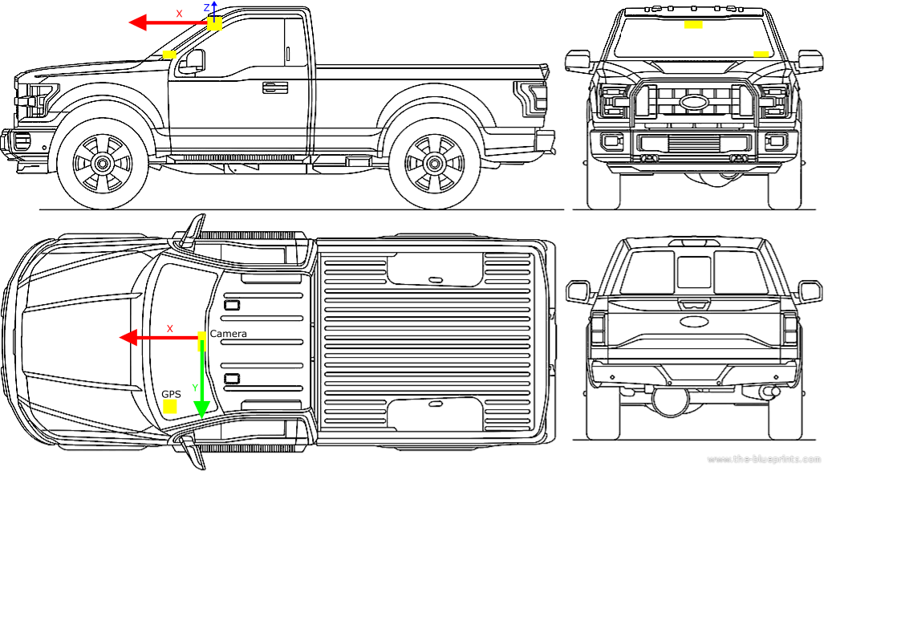

# Documentation du jeu de données de position
Ce jeu de données rassemble un grand nombre d'images prisent à des mêmes points de référence avec des conditions météorologiques différentes.

# Guide sur l'installation
Un échantillon des données est présent dans "database_presentation".
La jeu de données complet composé de 1221 dossiers pour un total de 49 728 images est disponible pour le téléchargement à cette adresse:
https://s3.console.aws.amazon.com/s3/object/pacman-position-ds-export?region=us-east-1&prefix=images.zip

**Attention**: La base de données pèse 15.4 Go.

# Description des données
Chaque dossier représente un point de passage, il contient entre 2 et 329 images prisent à ce même point. 

## Images 
Voici un exemple de 9 images prisent au même point avec des conditions météorologiques différentes.


## Structure des documents
Chaque dossier contient les images prisent en un point avec un seul JSON qui contient la position GPS du point de référence, le nom de chaque image avec la date et la météo donnée par l'API (Open-Meteo).

    .
    ├── pos1
    │   ├── img1.jpg
    │   ├── img2.jpg
    │   ├── ...
    │   └── informations.json         
    ├── camera_calibration.json
    └── ...

*Strucutre d'**informations.json**:*
```json
{
  "location": {
    "longitude": -72.68331306797108,
    "latitude": 46.63511346710158
  },
  "n_images": 10,
  "images": [
    {
      "name": "position_trigger_11_18_2022-07_17_43.jpg",
      "date": "2022-11-18 12:17:43.758705+00:00",
      "weathercode": 1.0,
      "meteo": "Mainly Clear"
    },
    {"...":"..."} 
  ]
}
```

## Meteo 
Chaque image contient "weathercode" et "meteo", ces deux informations sont redondantes. "weathercode" est le code de la météo donné par l'API (Open-Meteo) et "meteo" est la signification du code.
**Note**: La prédiction de la météo peut être fausse et ne pas correspondre exactement à la météo que l'on peut voir sur une image mais elle donne une bonne indication.


| Weathercode | Meteo | Traduction française |
| --- | --- | --- |
| 0 | Clear Sky | Ciel dégagé |
| 1 | Mainly Clear | Principalement dégagé |
| 2 | Partly Cloudy | Partiellement nuageux |
| 3 | Overcast | Couvert |
| 45 | Fog | Brouillard |
| 48 | Depositing Rime Fog | Brouillard givrant |
| 51 | Light Drizzle | Légère bruine |
| 53 | Moderate Drizzle | Bruine modérée |
| 55 | Dense Intensity Drizzle | Bruine forte |
| 56 | Light Freezing Drizzle | Légère bruine verglaçante |
| 57 | Dense Intensity Freezing Drizzle | Bruine verglaçante forte |
| 61 | Slight Rain | Pluie légère |
| 63 | Moderate Rain | Pluie modérée |
| 65 | Heavy intensity Rain | Pluie forte |
| 66 | Light Freezing Rain | Légère pluie verglaçante |
| 67 | Heavy Intensity Freezing Rain | Pluie verglaçante forte |
| 71 | Slight Snow fall | Légère chute de neige |
| 73 | Moderate Snow fall | Chute de neige modérée |
| 75 | Heavy Intensity Snow fall | Chute de neige forte |
| 77 | Snow Grains | Grains de neige |
| 80 | Slight Rain Showers | Légères averses de pluie |
| 81 | Moderate Rain Showers | Averses de pluie modérées |
| 82 | Violent Rain Showers | Averses de pluie violentes |
| 85 | Slight Snow Showers | Légères averses de neige |
| 86 | Heavy Snow Showers | Averses de neige fortes |
| 95 | Thunderstorm | Orage |
| 96 | Thunderstorm With Slight | Orage avec légère pluie |
| 99 | Thunderstorm With Heavy Hail | Orage avec fortes chutes de grêle |

## Calibration de la caméra
Le fichier "camera_calibration.json" contient les paramètres de calibration de la caméra utilisée pour prendre les images.


# Génération des données
8072 points ont été générés sur les routes du Québec à l'aide d'un script python et des données sur routes fournies par le MTQ (disponibles à l'adresse suivante: https://www.donneesquebec.ca/recherche/dataset/reseau-routier-rtss) 


Du côté hardware, des véhicules du MTQ ont été équipé d'une caméra et d'un GPS comme présenté sur la figure suivante:


Lorsqu'un véhicule passe par un des points de passage, il prend une photo qui est enregistrée avec ses informations sur la localisation, la date et l'heure. Ensuite l'api d'Open-Meteo est utilisée pour obtenir la prédiction de la météo correspondante à la date et l'heure de la photo.

Enfin le jeu de données est fabriqué en associant les images à leur point de passage et en ajoutant les informations de météo dans un fichier JSON.


# Améliorations possibles
* Séparation d'un même point de passage en fonction des différentes bandes de la route
* Vérification visuelle des images pour retire des images qui seraient vraiment mauvaises (vision de la caméra obstruée, prise de la photo trop loin du point de passage, etc...)
* Validation de la météo par un humain
* Anonymisation du dataset exporté