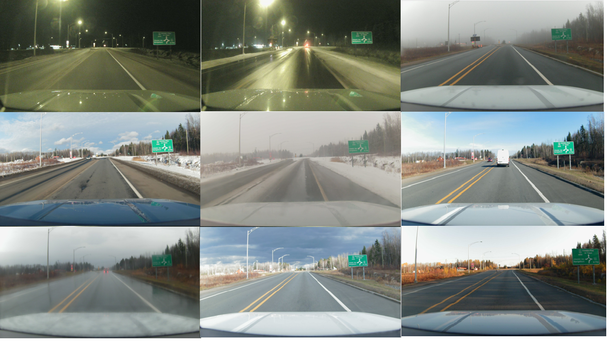
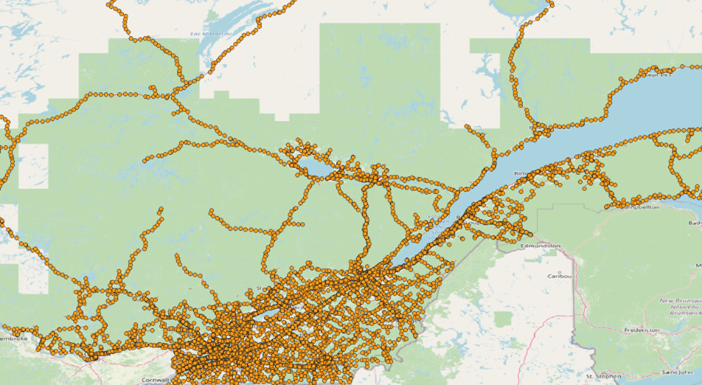

# Documentation du jeu de données de position
IVI Solution présente un jeu de données d'images des routes Québécoises. Ce jeu de données est composé d'images de la roue associée à une position GPS et à une météo.
Ces données ont été récupérées sur des routes Québécoises par une flotte de véhicules du Ministère du Transport du Québec.
Cet ensemble de données répertorie X points de passages sur les routes, chacun avec un minimum de Y images. 


# Guide sur l'installation
Un échantillon des données est présent dans "database_presentation"


# Description des données

## Images 
Exemple de 9 images prisent au même point avec des conditions météorologiques différentes.



## Structure des documents
Chaque dossier contient les images prisent en un point avec un seul JSON qui contient la position GPS du point de référence, le nom de chaque image avec la date et la météo donnée par l'API (Open-Meteo).

Différents véhicules ont été utilisés pour générer la base de données, ceux-ci ont des calibrations de caméra différentes qui sont spécifiées pour chacun. Chaque image pointe vers une calibration.


    .
    ├── pos1
    │   ├── img1.jpg
    │   ├── img2.jpg
    │   ├── ...
    │   └── informations.json         
    ├── camera_calibration.json
    └── ...

*Strucutre d'**informations.json**:*
```json
{
  "location": {
    "longitude": -72.68331306797108,
    "latitude": 46.63511346710158
  },
  "n_images": 10,
  "images": [
    {
      "name": "position_trigger_11_18_2022-07_17_43.jpg",
      "date": "2022-11-18 12:17:43.758705+00:00",
      "weathercode": 1.0,
      "meteo": "Mainly Clear",
      // "camera_informations": null
    },
    {"...":"..."} 
  ]
}
```

*Structure de **camera_calibration.json**:*
```json
{
"calibrations":[
  null, // calibration du véhicule 1
  null
]
}

```

## Meteo 
Chaque image contient "weathercode" et "meteo", ces deux informations sont redondantes. "weathercode" est le code de la météo donné par l'API (Open-Meteo) et "meteo" est la signification du code.


## Génération des données
8072 points ont été générés sur les routes du Québec. 



